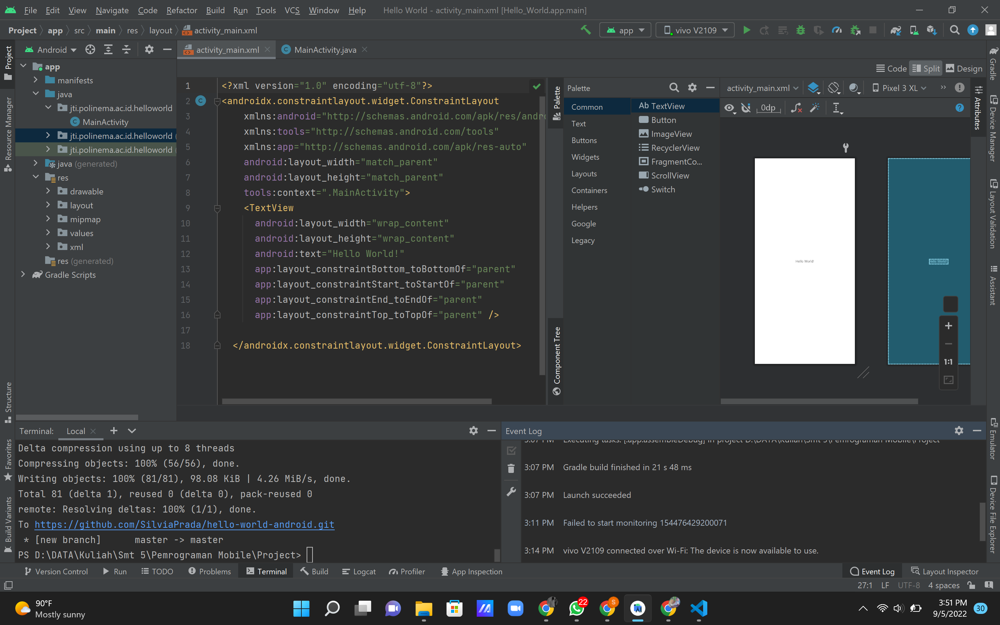
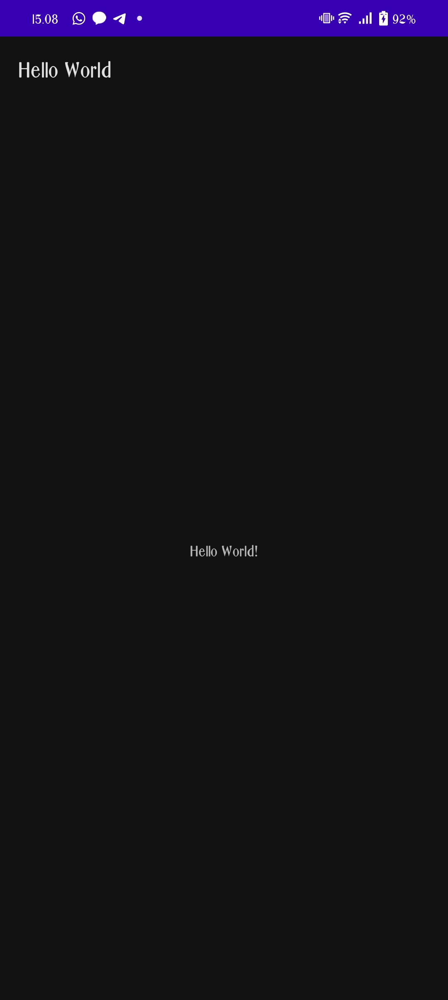

# Project Hello World Android Studio
Nama : Silvia Prada Aprilia  
NIM : 2041720141  
Kelas : TI-3C  

### Tugas 1
Membuat project Hello World di Android Studio, lalu push ke repository GitHub dengan nama hello-world-android

### Hasil Praktikum
Screenshots Laptop

Screenchots HandPhone

